# Changelog - YowYob Pay

## Atlas fonctionnel et architecture (Mermaid)

Cette section décrit **comment le projet fonctionne** au-delà des listes à puces : flux HTTP, persistance réactive, idempotence, messaging Kafka, cache, sécurité et erreurs. Elle couvre surtout **`payment-service-main`** ; les encarts *user-payment* reprennent ce qui est décrit plus bas dans ce changelog.

### Vue d’ensemble des acteurs et dépendances

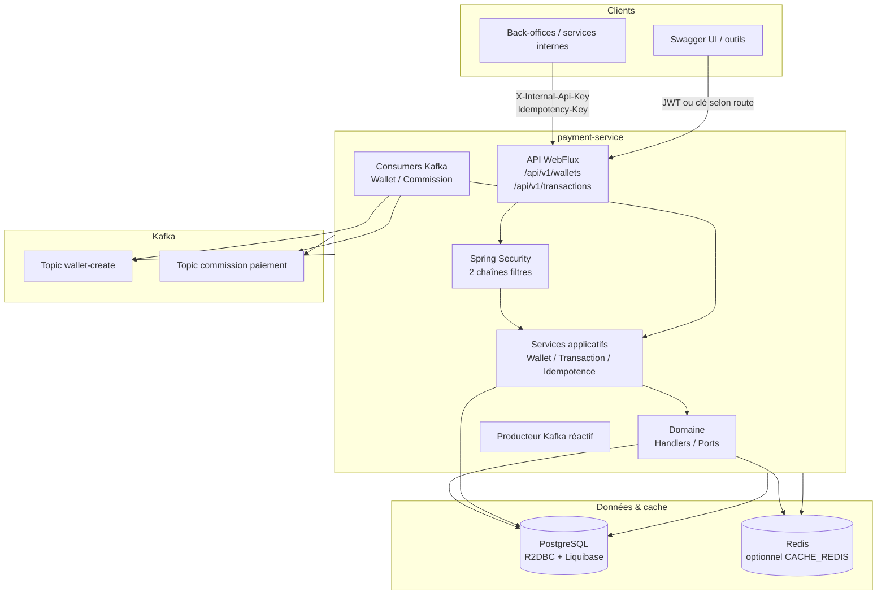
```mermaid
flowchart TB
    subgraph clients["Clients"]
        BO["Back-offices / services internes"]
        SWG["Swagger UI / outils"]
    end
    subgraph payment["payment-service"]
        API["API WebFlux\n/api/v1/wallets\n/api/v1/transactions"]
        SEC["Spring Security\n2 chaînes filtres"]
        APP["Services applicatifs\nWallet / Transaction / Idempotence"]
        DOM["Domaine\nHandlers / Ports"]
        KIN["Consumers Kafka\nWallet / Commission"]
        KOUT["Producteur Kafka réactif"]
    end
    subgraph data["Données & cache"]
        PG[("PostgreSQL\nR2DBC + Liquibase")]
        RD[("Redis\noptionnel CACHE_REDIS")]
    end
    subgraph bus["Kafka"]
        TWC["Topic wallet-create"]
        TPC["Topic commission paiement"]
    end
    BO -->|X-Internal-Api-Key\nIdempotency-Key| API
    SWG -->|JWT ou clé selon route| API
    API --> SEC --> APP --> DOM
    DOM --> PG
    APP --> PG
    KIN --> TWC
    KIN --> TPC
    KIN --> APP
    DOM --> RD
    payment --> PG
    payment --> RD
    payment --> TWC
    payment --> TPC
```

### Chaînes de sécurité WebFlux (payment-service)

Deux chaînes : métier **wallets/transactions** par clé interne ; le reste (Swagger, Actuator, etc.) par **JWT**.

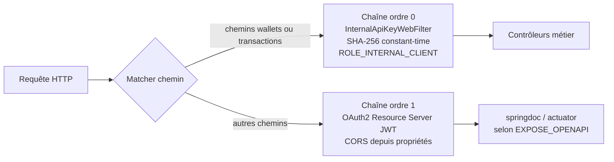
```mermaid
flowchart LR
    REQ["Requête HTTP"] --> ORD{Matcher chemin}
    ORD -->|chemins wallets ou transactions| CH0["Chaîne ordre 0\nInternalApiKeyWebFilter\nSHA-256 constant-time\nROLE_INTERNAL_CLIENT"]
    ORD -->|autres chemins| CH1["Chaîne ordre 1\nOAuth2 Resource Server JWT\nCORS depuis propriétés"]
    CH0 --> CTRL["Contrôleurs métier"]
    CH1 --> SWAG["springdoc / actuator\nselon EXPOSE_OPENAPI"]
```

### Cycle de vie d’un portefeuille (API + persistance)

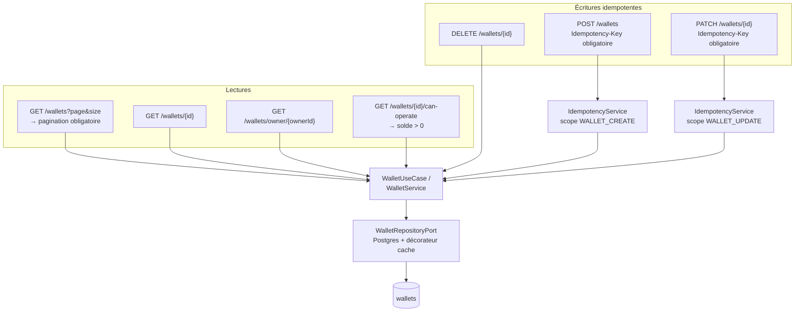
```mermaid
flowchart TD
    subgraph lecture["Lectures"]
        L1["GET /wallets?page&size\n→ pagination obligatoire"]
        L2["GET /wallets/{id}"]
        L3["GET /wallets/owner/{ownerId}"]
        L4["GET /wallets/{id}/can-operate\n→ solde > 0"]
    end
    subgraph ecriture["Écritures idempotentes"]
        C1["POST /wallets\nIdempotency-Key obligatoire"]
        U1["PATCH /wallets/{id}\nIdempotency-Key obligatoire"]
        D1["DELETE /wallets/{id}"]
    end
    L1 --> WS["WalletUseCase /\nWalletService"]
    L2 --> WS
    L3 --> WS
    L4 --> WS
    C1 --> IDEM["IdempotencyService\nscope WALLET_CREATE"]
    U1 --> IDEM2["IdempotencyService\nscope WALLET_UPDATE"]
    D1 --> WS
    IDEM --> WS
    IDEM2 --> WS
    WS --> WR["WalletRepositoryPort\nPostgres + décorateur cache"]
    WR --> PG[("wallets")]
```

### Cycle de vie d’une transaction HTTP (recharge vs paiement)

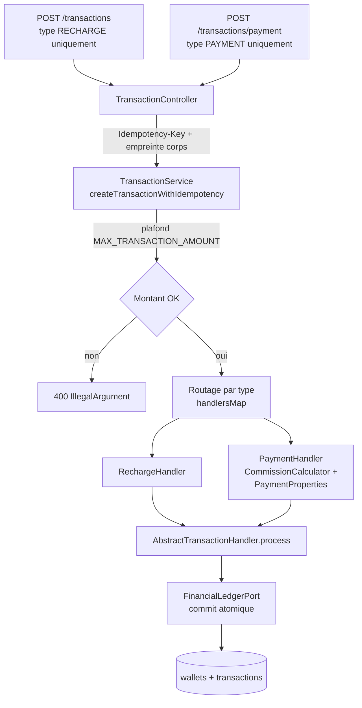
```mermaid
flowchart TD
    R["POST /transactions\ntype RECHARGE uniquement"] --> TR["TransactionController"]
    P["POST /transactions/payment\ntype PAYMENT uniquement"] --> TR
    TR -->|Idempotency-Key + empreinte corps| TS["TransactionService\ncreateTransactionWithIdempotency"]
    TS -->|plafond MAX_TRANSACTION_AMOUNT| OK{Montant OK}
    OK -->|non| E400["400 IllegalArgument"]
    OK -->|oui| MAP["Routage par type\nhandlersMap"]
    MAP --> RH["RechargeHandler"]
    MAP --> PH["PaymentHandler\nCommissionCalculator +\nPaymentProperties"]
    RH --> ATH["AbstractTransactionHandler.process"]
    PH --> ATH
    ATH --> FL["FinancialLedgerPort\ncommit atomique"]
    FL --> PG[("wallets + transactions")]
```

### Séquence : traitement métier d’une transaction (handler + ledger)

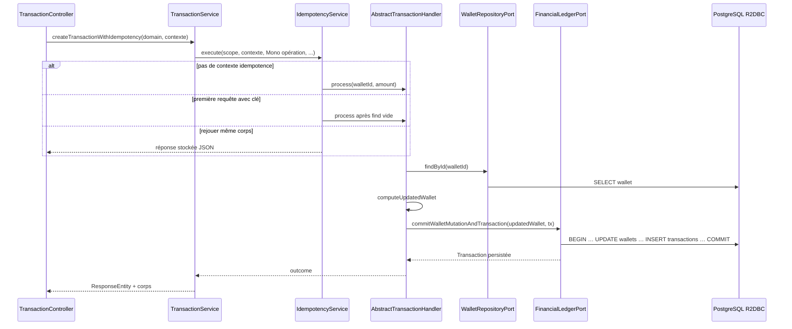
```mermaid
sequenceDiagram
    participant C as TransactionController
    participant S as TransactionService
    participant I as IdempotencyService
    participant H as AbstractTransactionHandler
    participant W as WalletRepositoryPort
    participant L as FinancialLedgerPort
    participant DB as PostgreSQL R2DBC
    C->>S: createTransactionWithIdempotency(domain, contexte)
    S->>I: execute(scope, contexte, Mono opération, ...)
    alt pas de contexte idempotence
        I->>H: process(walletId, amount)
    else première requête avec clé
        I->>H: process après find vide
    else rejouer même corps
        I-->>C: réponse stockée JSON
    end
    H->>W: findById(walletId)
    W->>DB: SELECT wallet
    H->>H: computeUpdatedWallet
    H->>L: commitWalletMutationAndTransaction(updatedWallet, tx)
    L->>DB: BEGIN … UPDATE wallets … INSERT transactions … COMMIT
    L-->>H: Transaction persistée
    H-->>S: outcome
    S-->>C: ResponseEntity + corps
```

### Atomicité financière : une seule transaction SQL réactive

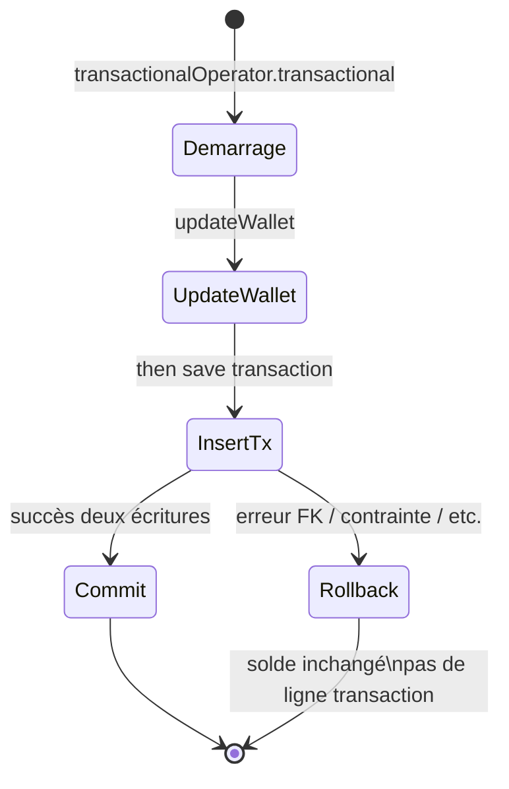
```mermaid
stateDiagram-v2
    [*] --> Demarrage: transactionalOperator.transactional
    Demarrage --> UpdateWallet: updateWallet
    UpdateWallet --> InsertTx: then save transaction
    InsertTx --> Commit: succès deux écritures
    InsertTx --> Rollback: erreur FK / contrainte / etc.
    Commit --> [*]
    Rollback --> [*]: solde inchangé\npas de ligne transaction
```

### Idempotence HTTP : machine à états côté service

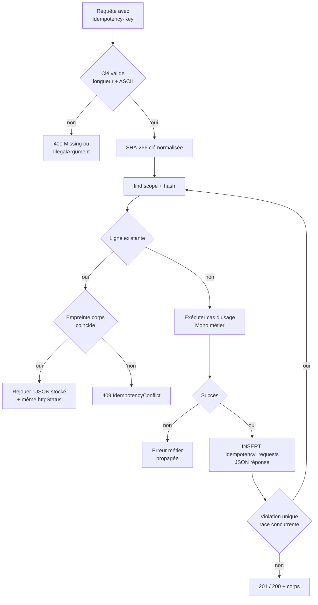
```mermaid
flowchart TD
    A["Requête avec\nIdempotency-Key"] --> V{Clé valide\nlongueur + ASCII}
    V -->|non| B400["400 Missing ou\nIllegalArgument"]
    V -->|oui| H["SHA-256 clé normalisée"]
    H --> F["find scope + hash"]
    F --> G{Ligne existante}
    G -->|oui| FP{Empreinte corps\ncoincide}
    FP -->|oui| REP["Rejouer : JSON stocké\n+ même httpStatus"]
    FP -->|non| C409["409 IdempotencyConflict"]
    G -->|non| OP["Exécuter cas d’usage\nMono métier"]
    OP --> OK{Succès}
    OK -->|non| ERR["Erreur métier\npropagée"]
    OK -->|oui| ST["INSERT idempotency_requests\nJSON réponse"]
    ST --> RACE{Violation unique\nrace concurrente}
    RACE -->|oui| F
    RACE -->|non| CRE["201 / 200 + corps"]
```

### Modèle de données relationnel (extraits payment-service)

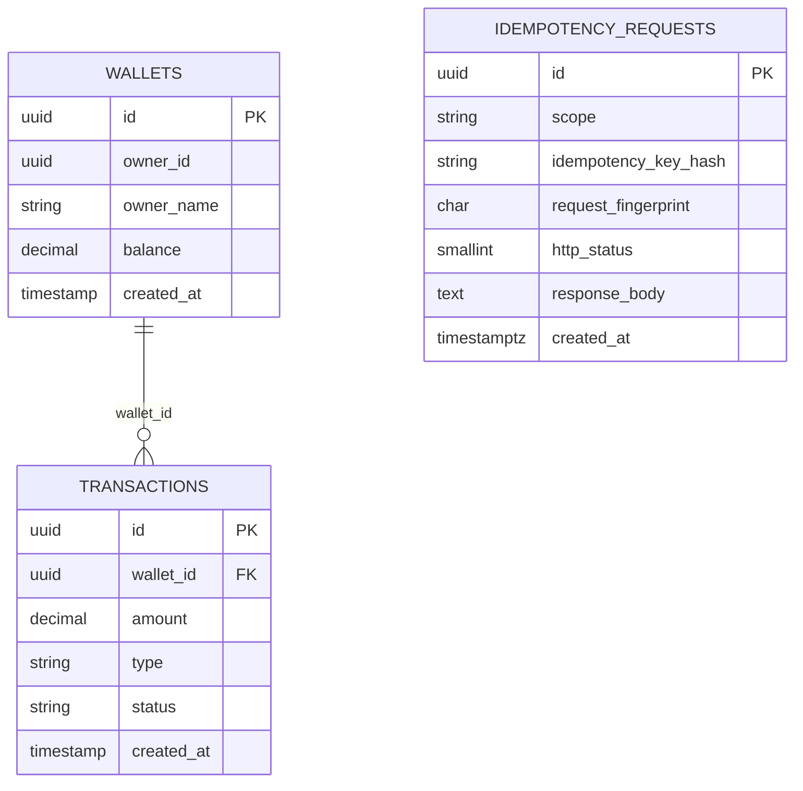
```mermaid
erDiagram
    WALLETS ||--o{ TRANSACTIONS : "wallet_id"
    WALLETS {
        uuid id PK
        uuid owner_id
        string owner_name
        decimal balance
        timestamp created_at
    }
    TRANSACTIONS {
        uuid id PK
        uuid wallet_id FK
        decimal amount
        string type
        string status
        timestamp created_at
    }
    IDEMPOTENCY_REQUESTS {
        uuid id PK
        string scope
        string idempotency_key_hash
        char request_fingerprint
        smallint http_status
        text response_body
        timestamptz created_at
    }
```

### Consommateur Kafka : création de portefeuille (idempotence best-effort)

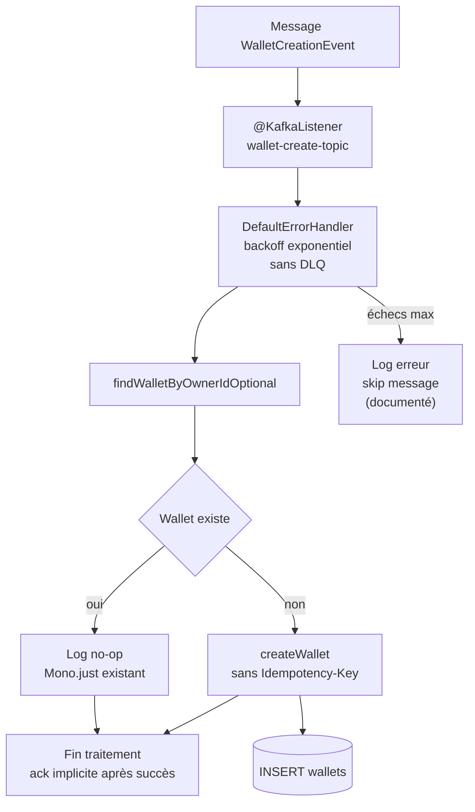
```mermaid
flowchart TD
    M["Message WalletCreationEvent"] --> L["@KafkaListener\nwallet-create-topic"]
    L --> EH["DefaultErrorHandler\nbackoff exponentiel\nsans DLQ"]
    EH --> OPT["findWalletByOwnerIdOptional"]
    OPT --> EX{Wallet existe}
    EX -->|oui| NOOP["Log no-op\nMono.just existant"]
    EX -->|non| CW["createWallet\nsans Idempotency-Key"]
    CW --> PG[("INSERT wallets")]
    NOOP --> ACK["Fin traitement\nack implicite après succès"]
    CW --> ACK
    EH -->|échecs max| AB["Log erreur\nskip message\n(documenté)"]
```

### Consommateur Kafka : commission paiement (taux unique)

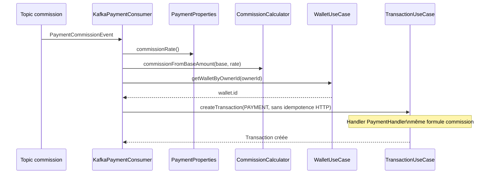
```mermaid
sequenceDiagram
    participant K as Topic commission
    participant C as KafkaPaymentConsumer
    participant P as PaymentProperties
    participant CC as CommissionCalculator
    participant W as WalletUseCase
    participant T as TransactionUseCase
    K->>C: PaymentCommissionEvent
    C->>P: commissionRate()
    C->>CC: commissionFromBaseAmount(base, rate)
    C->>W: getWalletByOwnerId(ownerId)
    W-->>C: wallet.id
    C->>T: createTransaction(PAYMENT, sans idempotence HTTP)
    Note over T: Handler PaymentHandler\nmême formule commission
    T-->>C: Transaction créée
```

### Cache Redis du solde portefeuille (lecture)

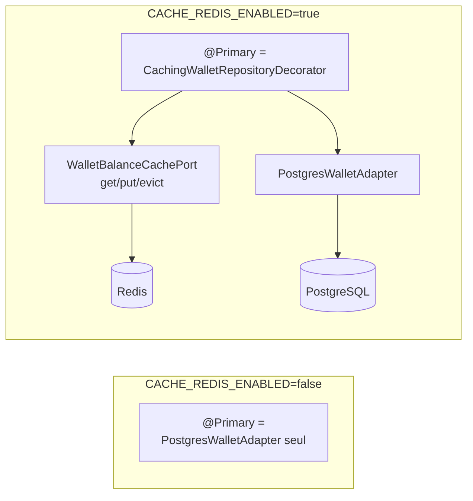
```mermaid
flowchart LR
    subgraph sans_redis["CACHE_REDIS_ENABLED=false"]
        A1["@Primary =\nPostgresWalletAdapter seul"]
    end
    subgraph avec_redis["CACHE_REDIS_ENABLED=true"]
        A2["@Primary =\nCachingWalletRepositoryDecorator"]
        A2 --> CACHE["WalletBalanceCachePort\nget/put/evict"]
        A2 --> PG2["PostgresWalletAdapter"]
        CACHE --> RD[("Redis")]
        PG2 --> DB2[("PostgreSQL")]
    end
```

### Chemins d’erreur HTTP (extraits `GlobalExceptionHandler`)

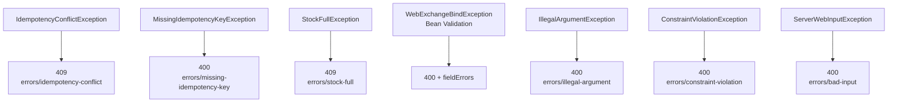
```mermaid
flowchart TD
    E1["IdempotencyConflictException"] --> R409["409\nerrors/idempotency-conflict"]
    E2["MissingIdempotencyKeyException"] --> R400a["400\nerrors/missing-idempotency-key"]
    E3["StockFullException"] --> R409b["409\nerrors/stock-full"]
    E4["WebExchangeBindException\nBean Validation"] --> R400b["400 + fieldErrors"]
    E5["IllegalArgumentException"] --> R400c["400\nerrors/illegal-argument"]
    E6["ConstraintViolationException"] --> R400d["400\nerrors/constraint-violation"]
    E7["ServerWebInputException"] --> R400e["400\nerrors/bad-input"]
```

### Configuration : propriétés métier regroupées

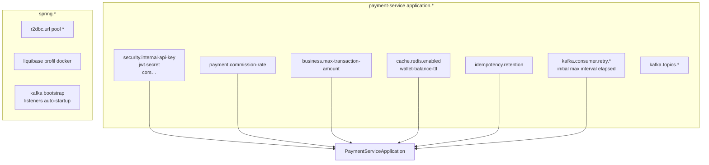
```mermaid
flowchart TB
    subgraph payment_props["payment-service application.*"]
        SECP["security.internal-api-key\njwt.secret\ncors…"]
        PAY["payment.commission-rate"]
        BUS["business.max-transaction-amount"]
        CACHE["cache.redis.enabled\nwallet-balance-ttl"]
        IDEM["idempotency.retention"]
        KRETRY["kafka.consumer.retry.*\ninitial max interval elapsed"]
        KTOP["kafka.topics.*"]
    end
    subgraph spring_props["spring.*"]
        R2DBC["r2dbc.url pool *"]
        LQB["liquibase profil docker"]
        KAF["kafka bootstrap\nlisteners auto-startup"]
    end
    SECP --> PaymentServiceApplication
    PAY --> PaymentServiceApplication
    BUS --> PaymentServiceApplication
    CACHE --> PaymentServiceApplication
    IDEM --> PaymentServiceApplication
    KRETRY --> PaymentServiceApplication
```

### Déploiement local type Docker Compose (vue logique)

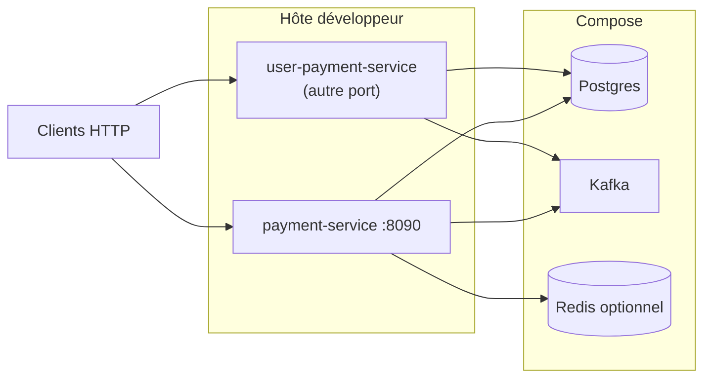
```mermaid
flowchart LR
    subgraph host["Hôte développeur"]
        PS["payment-service :8090"]
        UPS["user-payment-service\n(autre port)"]
    end
    subgraph compose["Compose"]
        PG[("Postgres")]
        KF["Kafka"]
        RD[("Redis optionnel")]
    end
    PS --> PG
    PS --> KF
    PS --> RD
    UPS --> PG
    UPS --> KF
    BO2["Clients HTTP"] --> PS
    BO2 --> UPS
```

### user-payment-service (rappel fonctionnel - phase sécurité / validation)

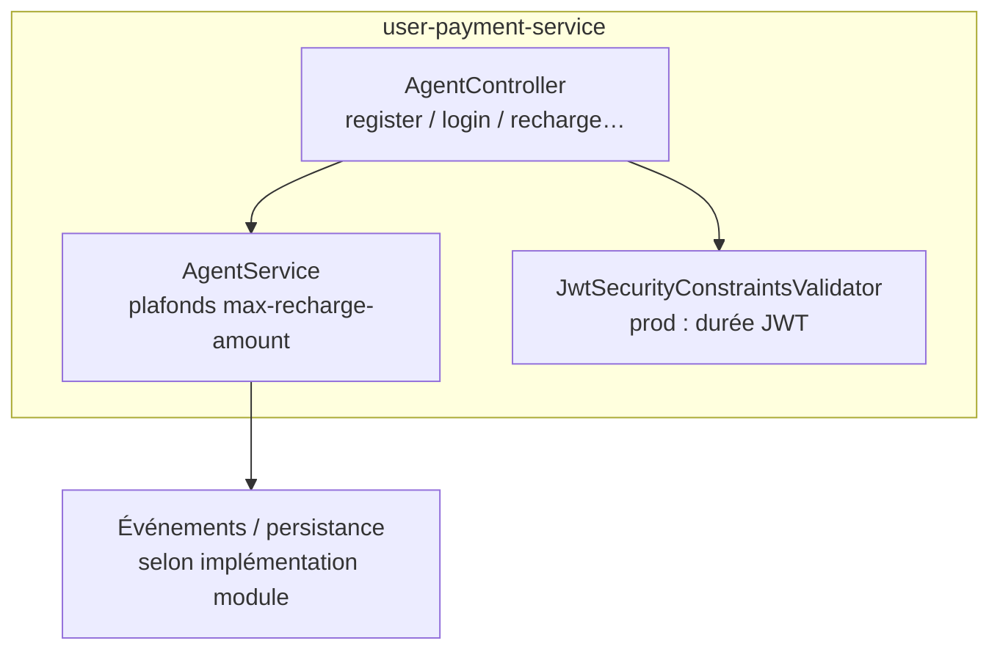
```mermaid
flowchart TD
    subgraph ups["user-payment-service"]
        AC["AgentController\nregister / login / recharge…"]
        AS["AgentService\nplafonds max-recharge-amount"]
        JWTv["JwtSecurityConstraintsValidator\nprod : durée JWT"]
    end
    AC --> AS
    AC --> JWTv
    AS --> EXT["Événements / persistance\nselon implémentation module"]
```

### Pagination obligatoire `GET /wallets`

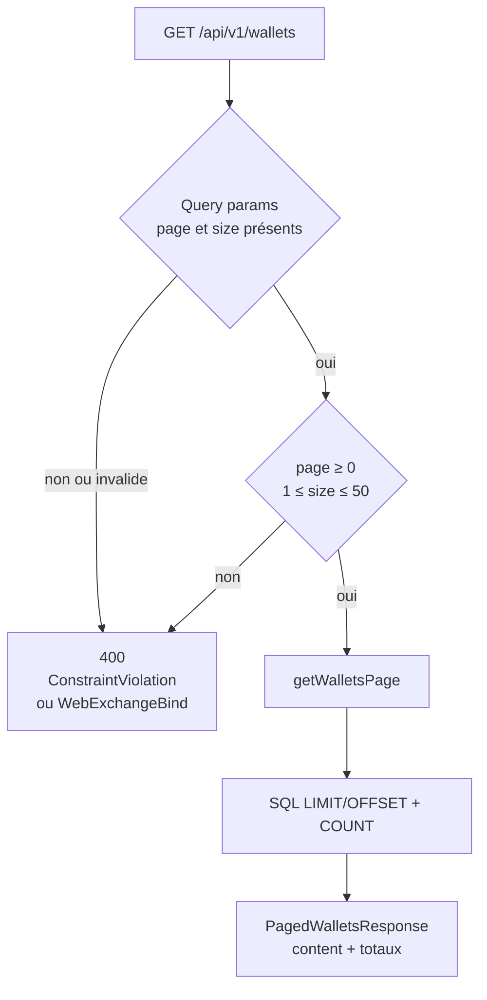
```mermaid
flowchart TD
    GET["GET /api/v1/wallets"] --> Q{"Query params\npage et size présents"}
    Q -->|non ou invalide| V400["400\nConstraintViolation\nou WebExchangeBind"]
    Q -->|oui| VAL{"page ≥ 0\n1 ≤ size ≤ 50"}
    VAL -->|non| V400
    VAL -->|oui| SVC["getWalletsPage"]
    SVC --> SQL["SQL LIMIT/OFFSET + COUNT"]
    SQL --> RESP["PagedWalletsResponse\ncontent + totaux"]
```

### Ordre des migrations Liquibase (schéma PostgreSQL)

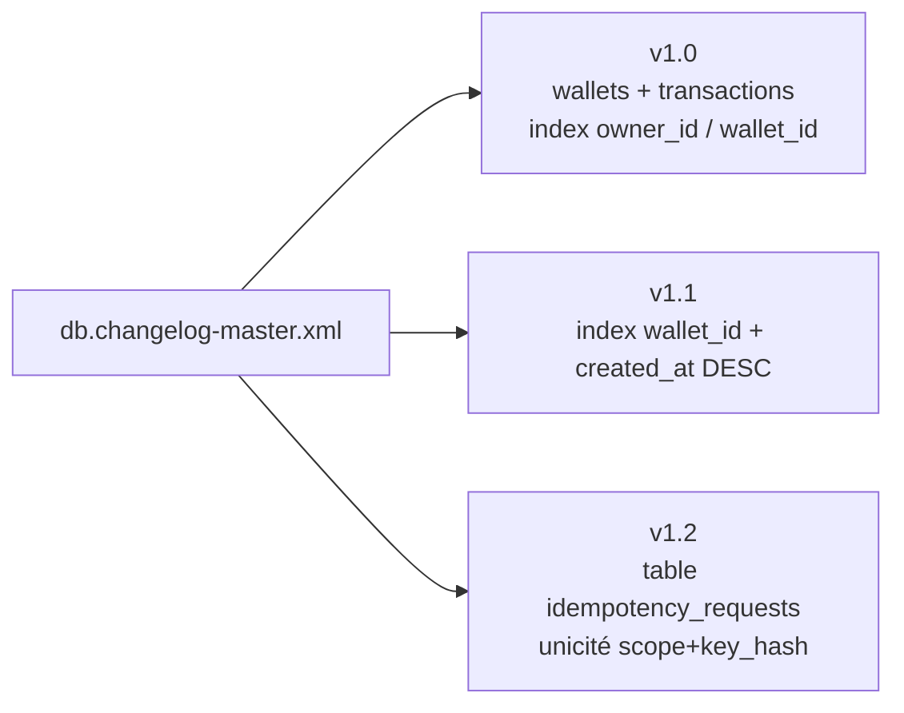
```mermaid
flowchart LR
    M0["db.changelog-master.xml"] --> V10["v1.0\nwallets + transactions\nindex owner_id / wallet_id"]
    M0 --> V11["v1.1\nindex wallet_id + created_at DESC"]
    M0 --> V12["v1.2\ntable idempotency_requests\nunicité scope+key_hash"]
```

### Architecture hexagonale simplifiée (payment-service)

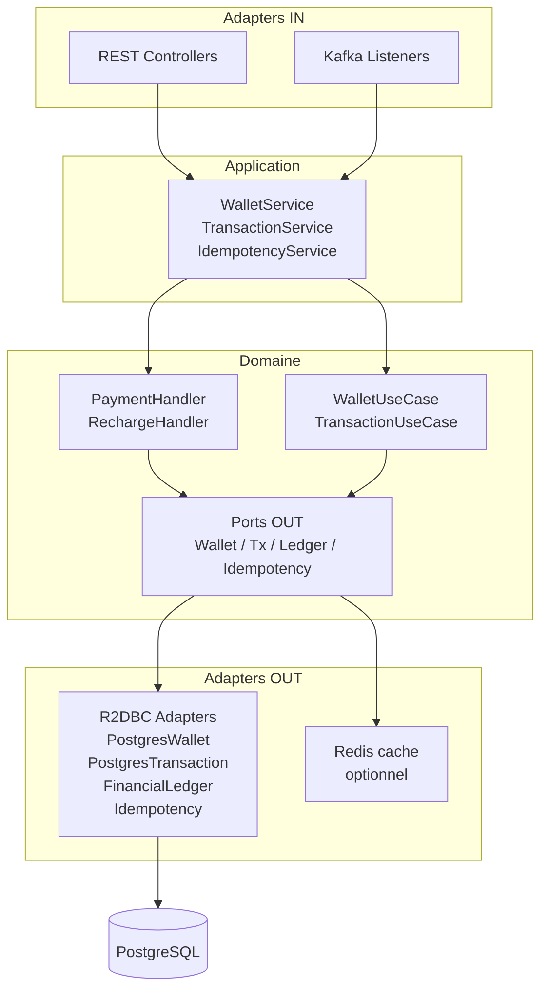
```mermaid
flowchart TB
    subgraph inbound["Adapters IN"]
        REST["REST Controllers"]
        KAF["Kafka Listeners"]
    end
    subgraph application["Application"]
        SVC["WalletService\nTransactionService\nIdempotencyService"]
    end
    subgraph domain["Domaine"]
        UC["WalletUseCase\nTransactionUseCase"]
        H["PaymentHandler\nRechargeHandler"]
        POUT["Ports OUT\nWallet / Tx / Ledger / Idempotency"]
    end
    subgraph outbound["Adapters OUT"]
        R2["R2DBC Adapters\nPostgresWallet\nPostgresTransaction\nFinancialLedger\nIdempotency"]
        RED["Redis cache\noptionnel"]
    end
    REST --> SVC
    KAF --> SVC
    SVC --> UC
    SVC --> H
    H --> POUT
    UC --> POUT
    POUT --> R2
    POUT --> RED
    R2 --> DB[("PostgreSQL")]
```

### Exposition API et observabilité

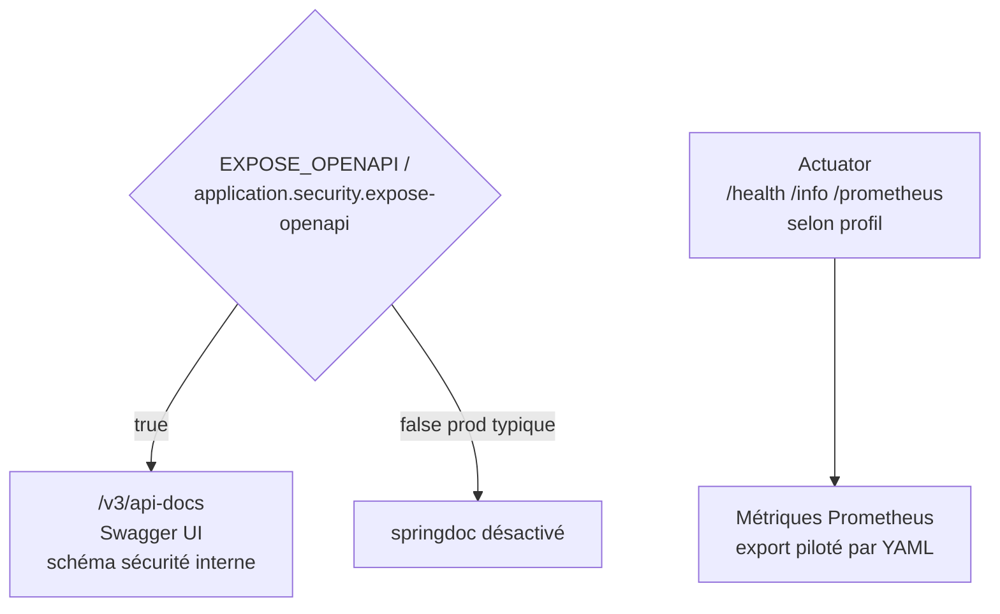
```mermaid
flowchart TD
    EXP{"EXPOSE_OPENAPI /\napplication.security.expose-openapi"}
    EXP -->|true| DOC["/v3/api-docs\nSwagger UI\nschéma sécurité interne"]
    EXP -->|false prod typique| OFF["springdoc désactivé"]
    ACT["Actuator\n/health /info /prometheus\nselon profil"] --> MET["Métriques Prometheus\nexport piloté par YAML"]
```

### Routage des types de transaction (deux endpoints REST)

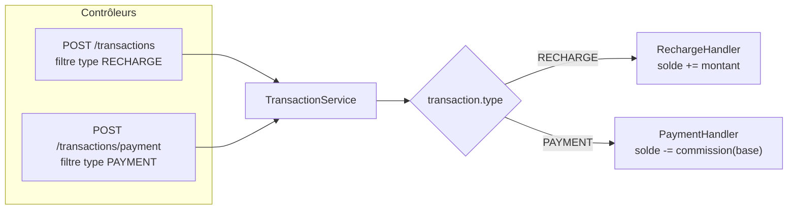
```mermaid
flowchart LR
    subgraph endpoints["Contrôleurs"]
        EP1["POST /transactions\nfiltre type RECHARGE"]
        EP2["POST /transactions/payment\nfiltre type PAYMENT"]
    end
    EP1 --> TS["TransactionService"]
    EP2 --> TS
    TS --> M{"transaction.type"}
    M -->|RECHARGE| RH["RechargeHandler\nsolde += montant"]
    M -->|PAYMENT| PH["PaymentHandler\nsolde -= commission(base)"]
```

### Légende des flux « écriture financière critique »

```mermaid
flowchart LR
    HTTP["HTTP interne\nclé + idempotence"] --> SVC["Service"]
    SVC --> DOM["Domaine handler"]
    DOM --> LED["FinancialLedgerPort\n1 transaction DB"]
    KFK["Kafka consumer"] --> SVC2["Service sans\nIdempotency-Key"]
    SVC2 --> DOM2["Handlers"]
    DOM2 --> LED
    style LED fill:#e8f5e9
    style DOM2 fill:#e8f5e9
```

---

## Cohérence et fiabilité financière (2026-05-23)

### Résumé

- **Atomicité R2DBC** : `FinancialLedgerPort` + `R2dbcFinancialLedgerAdapter` enferment `updateWallet` puis `save` (transaction) dans `TransactionalOperator` ; `AbstractTransactionHandler` ne persiste plus en deux temps séparés.
- **Idempotence HTTP** : table Liquibase `idempotency_requests`, port `IdempotencyPort`, service `IdempotencyService` ; en-tête **`Idempotency-Key` obligatoire** sur `POST /api/v1/wallets`, `PATCH /api/v1/wallets/{id}`, `POST /api/v1/transactions` et `POST /api/v1/transactions/payment` ; même clé + même corps → même réponse (201/200) ; même clé + corps différent → **409** (`ProblemDetail` type `errors/idempotency-conflict`).
- **Kafka** : `DefaultErrorHandler` avec backoff exponentiel (sans DLQ) ; abandon final loggé puis acquittement ; `WalletEventConsumer` no-op si un portefeuille existe déjà pour l’`ownerId`.
- **Commission** : `KafkaPaymentConsumer` aligné sur `PaymentProperties` + `CommissionCalculator` (déjà en place dans cette livraison).
- **Tests** : `FinancialLedgerAtomicityIT` et `IdempotencyWebFluxIT` (Testcontainers PostgreSQL, ignorés sans Docker), `KafkaListenerErrorConfigurationTest`, mocks `IdempotencyService` sur les `@WebFluxTest` existants.

### Breaking changes

- Clients des routes ci-dessus doivent envoyer **`Idempotency-Key`** (ASCII imprimable, longueur ≤ 256, normalisation insensible à la casse pour l’unicité) en plus de `X-Internal-Api-Key`.

### Variables d’environnement (nouvelles ou documentées)

| Variable | Service | Rôle |
|----------|---------|------|
| `IDEMPOTENCY_RETENTION` | payment | Durée indicative de rétention des lignes idempotence (ISO-8601, ex. `P7D`) - informationnel tant qu’aucune purge automatique n’est branchée |
| `KAFKA_LISTENER_RETRY_INITIAL_MS`, `KAFKA_LISTENER_RETRY_MULTIPLIER`, `KAFKA_LISTENER_RETRY_MAX_INTERVAL_MS`, `KAFKA_LISTENER_RETRY_MAX_ELAPSED_MS` | payment | Paramètres du backoff des listeners Kafka (sans DLQ) |

### Fichiers principaux (payment-service)

- Domaine : `FinancialLedgerPort`, `IdempotencyScope`, `IdempotencyContext`, exceptions idempotence
- Application : `IdempotencyService`, `WalletService`, `TransactionService`, `WalletUseCase` / `TransactionUseCase` (surcharges idempotence)
- API : `WalletController`, `TransactionController`, `GlobalExceptionHandler`
- Persistance : Liquibase `v1.2-idempotency-requests.xml`, `IdempotencyRequestEntity`, `IdempotencyRequestR2dbcRepository`, `R2dbcIdempotencyAdapter`
- Config : `R2dbcFinancialTransactionConfiguration`, `KafkaListenerErrorConfiguration`, `KafkaConsumerRetryProperties`, `IdempotencyProperties`, `application.yml`
- Kafka : `WalletEventConsumer`, `KafkaPaymentConsumer` (commission)
- Tests : `FinancialLedgerAtomicityIT`, `IdempotencyWebFluxIT`, mises à jour WebFluxTest portefeuille

### Limites connues

- **Kafka sans DLQ** : après épuisement du backoff, le message est abandonné (log + skip) - perte possible côté traitement (at-most-once après max tentatives).
- **Idempotence consumer commission** : pas de garde native contre doublons de message Kafka sur le prélèvement ; documenté ; wallet create couvert en best-effort par `findWalletByOwnerIdOptional`.

---

## Latence et rapidité des paiements - phase performance (2026-05-23)

### Résumé

- **Handlers** : `AbstractTransactionHandler` unifie le calcul du solde via `computeUpdatedWallet` (plus d’état mutable sur singleton) ; `PaymentHandler` applique la commission depuis `application.payment.commission-rate` (`PaymentProperties`).
- **Pagination** : `GET /api/v1/wallets` exige `page` (≥0) et `size` (1–50) ; réponse enveloppe `PagedWalletsResponse` ; port `findWalletsPage` + requête SQL `LIMIT`/`OFFSET` + `COUNT`.
- **Base** : index Liquibase `(wallet_id, created_at DESC)` et tri `findAllByWalletIdOrderByCreatedAtDesc` pour l’historique.
- **Pool R2DBC** : paramètres externalisés (`R2DBC_POOL_*`) avec défauts inchangés pour le dev.
- **Kafka** : schéma **v1** documenté sur les records d’événements ; tests de sérialisation JSON minimale.
- **Redis** : cache solde en lecture (`WalletBalanceCachePort` + `RedisWalletBalanceCacheAdapter`) avec invalidation via décorateur `CachingWalletRepositoryDecorator` (`@Primary` si `CACHE_REDIS_ENABLED=true`) ; service `redis` dans le compose racine.
- **Tests** : handlers, pagination WebFlux, binding pool, décorateur cache, Redis Testcontainers (si Docker disponible), sérialisation Kafka.

### Breaking changes

- Liste portefeuilles : **pagination obligatoire** (`?page=&size=`) ; clients existants doivent être mis à jour (voir exemple curl dans `DOCKER.md`).

### Variables d’environnement (nouvelles ou documentées)

| Variable | Service | Rôle |
|----------|---------|------|
| `R2DBC_POOL_INITIAL_SIZE`, `R2DBC_POOL_MAX_SIZE`, `R2DBC_POOL_MAX_IDLE_TIME`, `R2DBC_POOL_MAX_LIFE_TIME`, `R2DBC_POOL_ACQUIRE_RETRY`, `R2DBC_POOL_MAX_ACQUIRE_TIME`, `R2DBC_POOL_VALIDATION_QUERY` | payment | Pool R2DBC (défauts = anciennes valeurs YAML) |
| `CACHE_REDIS_ENABLED` | payment | Active cache Redis + décorateur (`true` en profil docker compose) |
| `REDIS_HOST`, `REDIS_PORT`, `REDIS_PASSWORD` | payment | Connexion Redis |
| `CACHE_WALLET_BALANCE_TTL` | payment | TTL cache solde (ISO-8601, ex. `PT30S`) |
| `REDIS_HOST_PORT` | compose | Publication port Redis sur l’hôte (défaut 6379) |

### Fichiers principaux impactés (payment-service)

- Domaine / handlers : `AbstractTransactionHandler`, `PaymentHandler`, `RechargeHandler`, `PaymentProperties`
- API : `WalletController`, `PagedWalletsResponse`, `GlobalExceptionHandler` (validation requête)
- Persistance : `WalletRepositoryPort`, `WalletPage`, `PostgresWalletAdapter`, `WalletR2dbcRepository`, `TransactionR2dbcRepository`, `PostgresTransactionAdapter`, `TransactionEntity`, Liquibase `v1.1-transactions-wallet-created-at-index.xml`
- Cache : `WalletBalanceCachePort`, `RedisWalletBalanceCacheAdapter`, `CachingWalletRepositoryDecorator`, `WalletCacheConfiguration`
- Config : `application.yml`, `application-docker.yml`, `PaymentServiceApplication`, `pom.xml` (Redis reactive, Testcontainers tests)
- Racine : `docker-compose.yml`, `.env.example`, `DOCKER.md`

---

## Sécurité - phase 1 (2026-05-23)

### Résumé

- Secrets et hôtes sensibles retirés des YAML « par défaut » : valeurs injectées par variables d’environnement ; profils `docker` et `prod` alignés.
- **payment-service** : les API `/api/v1/wallets/**` et `/api/v1/transactions/**` exigent l’en-tête `X-Internal-Api-Key` (comparaison via SHA-256 + `MessageDigest.isEqual`). Chaîne Spring Security dédiée (ordre 0) + chaîne JWT pour le reste (ordre 1).
- **Swagger / Actuator** : exposition OpenAPI pilotée par `EXPOSE_OPENAPI` / `application.security.expose-openapi` ; profil `prod` : springdoc désactivé, Actuator limité à `health`, métriques Prometheus désactivées côté payment (user-payment identique sur ces points).
- **CORS** : origines lues depuis `CORS_ALLOWED_ORIGINS` / `application.security.cors-allowed-origins-csv` (payment + user-payment).
- **Validation** : `WalletRequest`, `TransactionRequest`, `RegisterRequest`, `LoginRequest`, `RechargeRequest` ; plafonds `application.business.max-transaction-amount` (payment) et `max-recharge-amount` (user-payment) appliqués dans les services.
- **Erreurs 400** : `WebExchangeBindException` et `IllegalArgumentException` → `ProblemDetail` (RFC 7807).
- **user-payment** : validation JWT en profil `prod` (`JwtSecurityConstraintsValidator` : expiration ≤ 24 h et > 0).

### Breaking changes

- Tout client HTTP des routes **wallets** et **transactions** du `payment-service` doit envoyer l’en-tête `X-Internal-Api-Key` avec la valeur configurée (`PAYMENT_INTERNAL_API_KEY` / `application.security.internal-api-key`). **Swagger** : ajouter le schéma de sécurité « internalApiKey » (en-tête) dans l’UI avant d’exécuter les requêtes métier.
- Si `PAYMENT_INTERNAL_API_KEY` est vide en dehors du profil docker, les API métier répondent **503** (clé non configurée).

### Variables d’environnement (nouvelles ou documentées)

| Variable | Service | Rôle |
|----------|---------|------|
| `PAYMENT_INTERNAL_API_KEY` | payment | Clé API interne (backends) |
| `EXPOSE_OPENAPI` | les deux | Active/désactive springdoc (`api-docs` + `swagger-ui`) |
| `CORS_ALLOWED_ORIGINS` | les deux | Liste CSV d’origines CORS |
| `JWT_SECRET` | les deux | Secret JWT Base64 (déjà utilisé ; documenté comme obligatoire hors docker) |
| `MAX_TRANSACTION_AMOUNT` | payment | Plafond montant transaction |
| `MAX_RECHARGE_AMOUNT` | user-payment | Plafond recharge Kafka |
| `JWT_EXPIRATION_MS` | user-payment | Durée de vie JWT (ms) |

### Fichiers principaux modifiés ou ajoutés

**payment-service-main**

- `src/main/resources/application.yml`, `application-docker.yml`, `prod.application.yml`
- `src/main/java/.../config/SecurityConfig.java` (double chaîne + CORS)
- `src/main/java/.../config/SecurityProperties.java` (nouveau)
- `src/main/java/.../config/BusinessProperties.java` (nouveau)
- `src/main/java/.../security/InternalApiKeyWebFilter.java` (nouveau)
- `src/main/java/.../config/OpenApiConfig.java`
- `src/main/java/.../PaymentServiceApplication.java`
- `src/main/java/.../application/service/TransactionService.java`
- `src/main/java/.../rest/dto/WalletRequest.java`, `TransactionRequest.java`
- `src/main/java/.../rest/GlobalExceptionHandler.java`
- `src/test/java/.../WalletControllerSecurityWebFluxTest.java` (nouveau)
- `src/test/java/.../InternalApiKeyWebFilterTest.java` (nouveau)
- `src/test/java/.../dto/WalletRequestBeanValidationTest.java`, `TransactionRequestBeanValidationTest.java` (nouveaux)
- `pom.xml` (`spring-security-test`)
- `src/test/java/.../PaymentServiceApplicationTests.java` (désactivé sans infra)

**user-payment-service-main**

- `src/main/resources/application.yml`, `application-docker.yml`, `prod.application.yml`
- `src/main/java/.../config/SecurityConfig.java`, `UserPaymentSecurityProperties.java`, `UserBusinessProperties.java`, `JwtSecurityConstraintsValidator.java` (nouveaux)
- `src/main/java/.../UserPaymentService.java`
- `src/main/java/.../config/OpenApiConfig.java`
- `src/main/java/.../application/service/AgentService.java`
- `src/main/java/.../rest/dto/RegisterRequest.java`, `LoginRequest.java`, `RechargeRequest.java`
- `src/main/java/.../rest/AgentController.java`, `GlobalExceptionHandler.java`
- `src/test/java/.../AgentServiceRechargeLimitTest.java`, `RegisterRequestBeanValidationTest.java` (nouveaux)
- `src/test/java/.../ReactiveHexagonalApplicationTests.java` (désactivé sans infra)

**Racine**

- `docker-compose.yml`, `.env.example`
- `DOCKER.md`
- `changelogs.md` (ce fichier)

### Hors périmètre (documenté dans l’analyse)

- TLS Kafka/Postgres, mTLS, IdP (Keycloak), signature des messages Kafka.
