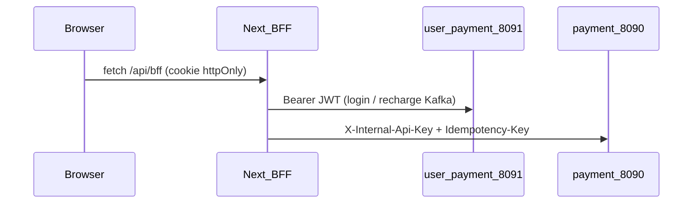

# Yowyob Pay - Frontend

Application Next.js (App Router) avec BFF, i18n (fr/en), charte graphique Option A (bleu marine / or) et police Nunito.

## Prérequis

- Node.js 20+
- Stack backend : `docker compose up` à la racine du monorepo (ports **8090** et **8091**)

## Configuration

```bash
cp .env.local.example .env.local
```

Variables obligatoires en local :

| Variable | Description |
|----------|-------------|
| `PAYMENT_SERVICE_BASE_URL` | URL payment-service (ex. `http://localhost:8090`) |
| `USER_PAYMENT_BASE_URL` | URL user-payment-service (ex. `http://localhost:8091`) |
| `PAYMENT_INTERNAL_API_KEY` | Même valeur que `PAYMENT_INTERNAL_API_KEY` à la racine |
| `JWT_SECRET` | Secret Base64 partagé avec les services Java |
| `SESSION_COOKIE_NAME` | Nom du cookie httpOnly (défaut `yowyob_session`) |

## Démarrage

```bash
npm install
npm run dev
```

Ouvrir [http://localhost:3000/fr](http://localhost:3000/fr).

## Architecture BFF



Le JWT n’est jamais exposé au JavaScript client : seul le BFF lit le cookie et appelle les backends.

## Scripts

- `npm run dev` - développement
- `npm run build` - build production
- `npm run lint` - ESLint
