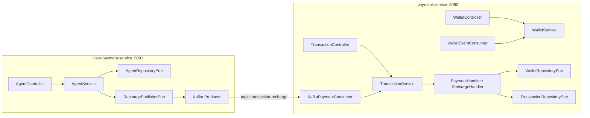

# Analyse - YowYob Pay (à jour)

## État actuel du dépôt

- **Orchestration** : un seul `docker-compose.yml` à la **racine** `yowyob-pay/` (PostgreSQL 2 bases, Zookeeper, Kafka, `payment-service`, `user-payment-service`). Pas de Redis dans la stack : le code ne l’utilise plus.
- **Par microservice** : chaque module a son `Dockerfile`, un `docker-compose.yml` (image seule, réseau `yowyob-net` partagé) et des fichiers `.env` / `.env.example`.
- **Documentation d’exécution** : voir **`DOCKER.md`** à la racine (commandes, URLs Swagger).
- **Profil Docker** : `application-docker.yml` dans chaque service (Liquibase, Postgres, Kafka en PLAINTEXT).
- **Nettoyage réalisé** : pas de `schema.sql` redondant (Liquibase uniquement), pas d’adaptateurs Redis/Kafka publication wallet morts, pas de dossier `bin/` dupliqué, pas de fichiers Compose vides.

---

## Vue d’ensemble

Le workspace contient **2 microservices Spring Boot réactifs** (WebFlux + R2DBC) en **architecture hexagonale** (Ports & Adapters). Système de paiement par portefeuille (wallet) avec agents.



> **Note** : le flux exact « recharge agent → payment » dépend d’un consommateur Kafka côté `payment-service` aligné sur le message émis par `KafkaRechargeAdapter` (à valider en intégration).

---

## Projet 1 : `payment-service-main`

### Rôle

Gestion des **portefeuilles** et des **transactions** (paiement avec commission, recharge), persistance PostgreSQL, consommation d’événements Kafka.

### Couches

| Couche | Composants | Rôle |
|--------|------------|------|
| **Domain** | `Wallet`, `Transaction`, `TransactionType`, `TransactionStatus` | Modèle immutable |
| **Ports IN** | `WalletUseCase`, `TransactionUseCase` | Cas d’usage exposés |
| **Ports OUT** | `WalletRepositoryPort`, `TransactionRepositoryPort` | Persistance |
| **Handlers** | `AbstractTransactionHandler` → `PaymentHandler`, `RechargeHandler` | Template method |
| **Application** | `WalletService`, `TransactionService` | Orchestration |
| **REST** | `WalletController`, `TransactionController` | API + OpenAPI |
| **Kafka IN** | `WalletEventConsumer`, `KafkaPaymentConsumer` | Consommation |
| **Adapters OUT** | `PostgresWalletAdapter`, `PostgresTransactionAdapter` | R2DBC |

### Infra (dépendances)

- **PostgreSQL** (R2DBC + Liquibase)
- **Kafka** (consommateurs + producteur réactif pour besoins internes)
- **Resilience4J** (circuit breaker configuré, ex. `stock-service`)
- **Spring Security** + OAuth2 Resource Server JWT (HMAC) - les routes API wallet/transaction sont en `permitAll` dans la config actuelle (à durcir en prod)

**Il n’y a plus** de couche Redis ni d’adaptateur de cache dans ce service.

---

## Projet 2 : `user-payment-service-main`

### Rôle

Inscription / login des **agents**, émission d’ordres de **recharge** via Kafka.

### Couches

| Couche | Composants | Rôle |
|--------|------------|------|
| **Domain** | `Agent` | Modèle agent |
| **Ports IN** | `AgentUseCase` | register, login, performRecharge |
| **Ports OUT** | `AgentRepositoryPort`, `RechargePublisherPort` | R2DBC + Kafka |
| **Application** | `AgentService` | Métier |
| **Security** | `JwtService`, `AuthenticationManager`, `SecurityContextRepository` | JWT |
| **REST** | `AgentController` | `/api/v1/auth/*`, recharge |
| **Kafka OUT** | `KafkaRechargeAdapter` | Topic `transaction-recharge` (configurable) |

### Infra

- **PostgreSQL** (R2DBC + Liquibase)
- **Kafka** (producteur)
- **JJWT** pour les tokens (secret Base64, aligné avec la config `application.security.jwt.*`)

**Plus de dépendance Redis** dans le `pom.xml` : rien n’utilisait le cache côté code.

---

## Docker : comment lancer (référence unique)

Tout est décrit dans **`DOCKER.md`**. En résumé :

```bash
cd yowyob-pay
docker compose up --build
```

- **Swagger payment** : <http://localhost:8090/swagger-ui.html>  
- **Swagger user-payment** : <http://localhost:8091/swagger-ui.html>  

Variables optionnelles : `.env` à la racine (voir `.env.example`).

**Pour un seul service** après avoir démarré l’infra depuis la racine :

```bash
docker compose up -d postgres zookeeper kafka
cd payment-service-main   # ou user-payment-service-main
docker compose up --build
```

Les anciens chemins du type `user-payment-service-main/bin/compose.yaml` ou des `compose.yaml` vides dans un module **n’existent plus** - à ne pas utiliser.

---

## Problèmes et pistes (synthèse)

Les points de sécurité et de concurrence évoqués précédemment (ex. `PaymentHandler` et champ mutable, secrets en dur dans `application.yml`, `.subscribe()` dans les listeners Kafka, `permitAll` sur les API) restent des **sujets de revue** pour la production.

Éléments **déjà traités ou retirés du dépôt** :

- `schema.sql` dupliqué supprimé (migrations Liquibase uniquement).
- Fichiers Compose vides / dossier `bin/` dupliqué supprimés.
- Redis et adaptateurs non utilisés retirés du code et des POMs.
- `WebClientConfig` vide supprimé (plus de classe fantôme).

Pour une liste détaillée des risques (race conditions, commission hardcodée vs YAML, etc.), se reporter au code des handlers et consumers dans `payment-service-main`.

---

## Pistes d’amélioration et d’optimisation (projet d’école)

Cette section regroupe des axes **réalistes** pour un rapport ou une soutenance : sécurité, performance, disponibilité, rapidité des paiements, et qualité logicielle. Elles s’appuient sur l’état actuel du dépôt (WebFlux, R2DBC, Kafka, Docker).

### Sécurité

| Thème | Constats / idées | Pistes concrètes |
|--------|------------------|------------------|
| **Secrets** | Clés JWT et mots de passe ne doivent pas rester dans les YAML versionnés. | Variables d’environnement, fichiers `.env` non commités, ou gestionnaire de secrets (Vault, Doppler) ; profils `dev` / `prod` séparés. |
| **API payment** | Les chemins wallet/transaction peuvent être en accès libre selon la config actuelle. | En prod : exiger un JWT (rôle métier) ou mTLS entre services ; réserver `permitAll` au swagger/actuator derrière un réseau interne. |
| **Auth agent** | JWT maison côté user-payment : durée de vie, révocation. | Durée courte + refresh tokens, ou passage à un IdP (Keycloak) pour le mémoire « sécurité avancée ». |
| **Transport** | Kafka / Postgres en clair en Docker de démo. | TLS pour Kafka et Postgres en environnement « quasi prod » ; SASL/SCRAM déjà évoqué dans `prod.application.yml` côté payment. |
| **Validation** | Entrées API et montants. | Renforcer `@Valid`, contraintes sur `WalletRequest` / `TransactionRequest`, plafonds métier (montant max, anti négatif). |

### Latence et rapidité des paiements (chemin critique)

**État (implémentation)** : une grande partie des pistes ci-dessous est réalisée dans le code - détail opérationnel dans [changelogs.md](changelogs.md) (section « Latence et rapidité des paiements - phase performance »).

| Thème | Idée | Détail |
|--------|------|--------|
| **Moins d’allers-retours DB** | Le flux paiement/recharge enchaîne lecture wallet → update → écriture transaction. | S’assurer d’index pertinents (`wallet_id`, `owner_id`) ; éviter `findAll` ou listes non paginées en charge. |
| **Pool R2DBC** | `application.yml` fixe déjà un pool. | Ajuster `max-size` / `max-acquire-time` selon charge simulée (tests de charge pour le rapport). |
| **Pas de cache** | Redis a été retiré faute d’usage. | **Option rapport** : réintroduire Redis **uniquement** pour lecture cache du solde ou métadonnées wallet en lecture seule, avec invalidation stricte après transaction - gain potentiel sur les lectures fréquentes ; le chemin d’écriture critique reste dominé par la DB. |
| **Sérialisation** | JSON sur Kafka et REST. | Payloads légers ; éviter gros objets inutiles dans les événements. |
| **Handler paiement** | `PaymentHandler` utilise un état mutable (`amountToRemove`) dans un singleton. | **Corriger** : calcul local dans `validate` / `applyBalance` sans champ d’instance → même ordre de latence mais **sûreté** et comportement prévisible sous concurrence. |

### Haute disponibilité et résilience

| Thème | Idée | Détail |
|--------|------|--------|
| **Plusieurs instances** | Un seul conteneur par service dans le compose actuel. | Documenter le scale horizontal (`replicas`) derrière un load balancer ; API **stateless** (JWT) côté user-payment → pas de session serveur à répliquer. |
| **Base de données** | Instance Postgres unique = point unique de défaillance. | Pour un rapport : réplication streaming, sauvegardes, ou lecture sur réplica pour les GET (si cohérence relaxée acceptable). |
| **Kafka** | Broker unique en démo. | Réplication des partitions, `min.insync.replicas`, durabilité des messages de recharge. |
| **Circuit breaker** | Resilience4j configuré pour un client « stock ». | Brancher un appel réel ou documenter timeouts / fallbacks pour les dépendances futures. |
| **Healthchecks** | Image Docker sans `HEALTHCHECK` explicite par défaut. | `HEALTHCHECK` sur `/actuator/health` pour redémarrage automatique et orchestration (Kubernetes). |

### Cohérence et fiabilité financière (fort impact à l’oral)

| Thème | Risque | Amélioration possible |
|--------|--------|------------------------|
| **Atomicité** | Solde mis à jour puis transaction enregistrée en deux temps. | Transaction SQL unique (même unité de travail) pour wallet + ligne comptable, ou pattern **outbox** + consommation fiable côté Kafka. |
| **Idempotence** | Retries ou double soumission. | En-tête `Idempotency-Key` ou contrainte métier unique en base. |
| **Consumers Kafka** | `.subscribe()` sans pipeline d’erreurs unifié. | Retry exponentiel, **DLQ** (dead letter topic), traitement idempotent des messages. |
| **Commission** | Risque d’écart entre config YAML et code (ex. 10 % en dur). | Une seule source : propriété `commission-rate` utilisée partout. |

### Observabilité (perception « projet mature »)

| Outil | Usage |
|--------|--------|
| **Logs structurés** | JSON avec corrélation (`traceId`, `walletId`) pour suivre un paiement de bout en bout. |
| **Métriques** | Actuator/Prometheus : timers sur `createTransaction`, latence p95/p99. |
| **Tracing** | OpenTelemetry + Jaeger pour les chaînes multi-services et Kafka. |

### Tests et charge (valorisation académique)

- Tests unitaires ciblés sur les handlers (soldes, commissions, cas d’erreur).
- **Testcontainers** (Postgres + Kafka) pour tests d’intégration réalistes.
- Scénarios **Gatling** ou **k6** sur les endpoints de transaction pour illustrer latence et débit dans le mémoire.

### Synthèse pour la soutenance

1. **Court terme** : secrets hors repo, sécurisation des API, correction de la concurrence dans `PaymentHandler`, commission centralisée, validation renforcée.  
2. **Moyen terme** : atomicité DB ou outbox, idempotence, healthchecks, métriques sur le chemin paiement.  
3. **Perspective** : HA multi-instances, Kafka/Postgres résilients, tracing distribué.

---

## Résumé

| Aspect | payment-service | user-payment-service |
|--------|-----------------|----------------------|
| **Port** | 8090 | 8091 |
| **Rôle** | Wallets + transactions | Agents + auth + recharge Kafka |
| **DB** | PostgreSQL (`payment_db`) | PostgreSQL (`payment`) |
| **Cache** | Aucun (Redis retiré) | Aucun |
| **Messaging** | Kafka (consumers) | Kafka (producer recharge) |
| **Auth** | JWT OAuth2 RS (routes souvent ouvertes en dev) | JWT JJWT sur routes protégées |

Architecture : hexagonale des deux côtés ; Docker unifié à la racine du repo.
